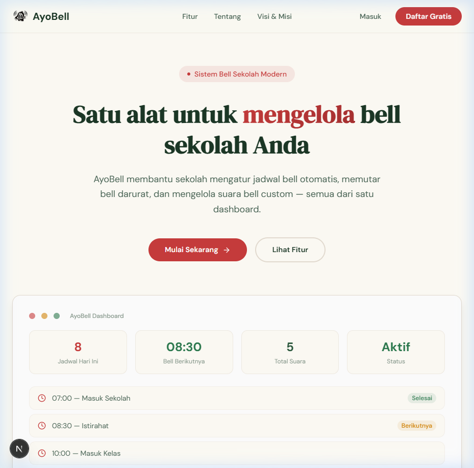
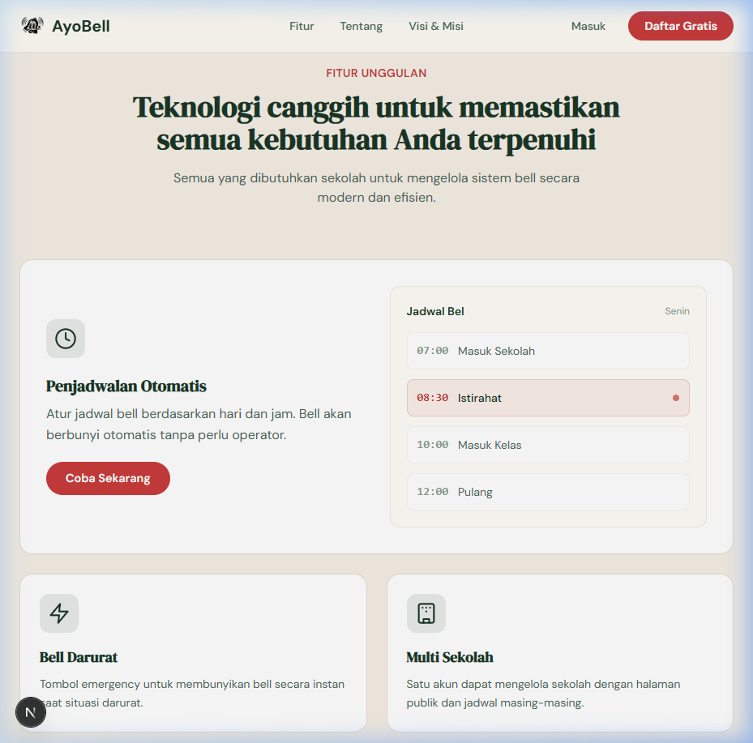
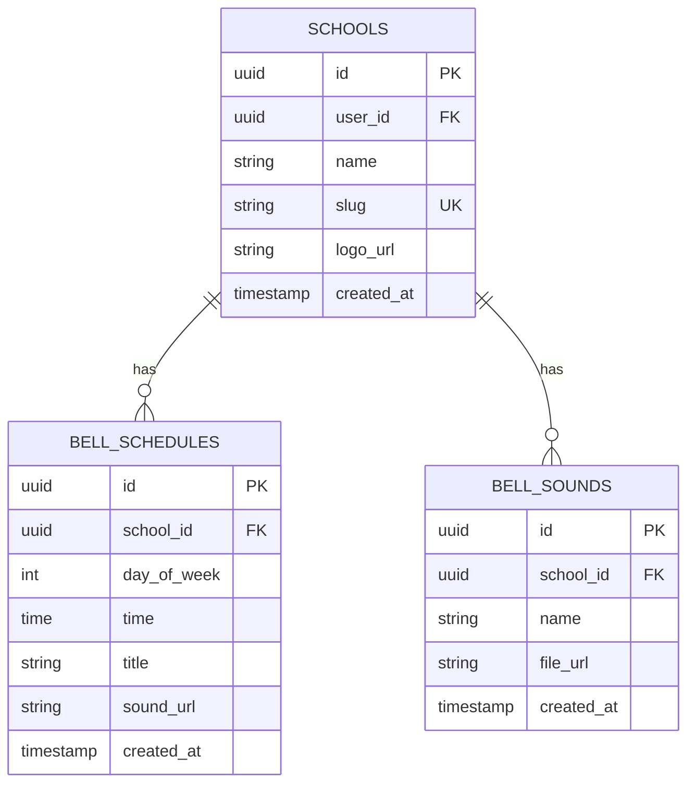

<div align="center">

# 🔔 AyoBell

### Sistem Bell Sekolah Otomatis

Platform manajemen bell sekolah berbasis web yang modern.
Atur jadwal, upload suara custom, dan bunyikan bell darurat — semua dari satu dashboard.

[](https://nextjs.org/)
[](https://supabase.com/)
[](https://tailwindcss.com/)
[](LICENSE)

<br />



</div>

---

## 📋 Tentang

**AyoBell** adalah aplikasi web untuk mengelola bell sekolah secara otomatis. Dibangun menggunakan Next.js dan Supabase, AyoBell memungkinkan sekolah mengatur jadwal bell harian tanpa perlu operator manual.

Cukup buat akun, daftarkan sekolah, atur jadwal — dan bell akan berbunyi otomatis di halaman publik sekolah.

### ✨ Fitur Utama

| Fitur | Deskripsi |
|---|---|
| ⏰ **Penjadwalan Otomatis** | Atur jadwal bell per hari dan jam. Bell berbunyi otomatis tanpa operator. |
| ⚡ **Bell Darurat** | Tombol emergency untuk membunyikan bell secara instan saat situasi darurat. |
| 🏫 **Multi Sekolah** | Satu akun dapat mengelola sekolah dengan halaman publik masing-masing. |
| 🎵 **Suara Bell Custom** | Upload file MP3/WAV. Pilih suara berbeda untuk setiap jadwal. |
| 🔄 **Realtime Updates** | Perubahan jadwal & bell darurat langsung ter-update tanpa refresh. |
| 📱 **Responsive** | Berfungsi sempurna di desktop, tablet, maupun smartphone. |

---

## 🖼️ Preview

<div align="center">



</div>

---

## 🛠️ Tech Stack

| Kategori | Teknologi |
|---|---|
| **Frontend** | Next.js 16 (App Router) |
| **Backend & Database** | Supabase (PostgreSQL) |
| **Authentication** | Supabase Auth |
| **Storage** | Supabase Storage |
| **Realtime** | Supabase Realtime |
| **Styling** | Tailwind CSS 4 |
| **Font** | DM Sans + DM Serif Display |

---

## 🚀 Cara Memulai

### Prasyarat

- [Node.js](https://nodejs.org/) versi 18 atau lebih baru
- [npm](https://www.npmjs.com/) atau package manager lainnya
- Akun [Supabase](https://supabase.com/) (gratis)

### 1. Clone Repository

```bash
git clone https://github.com/username/ayobell.git
cd ayobell
```

### 2. Install Dependencies

```bash
npm install
```

### 3. Setup Supabase

#### a. Buat Project Baru di Supabase

Pergi ke [supabase.com](https://supabase.com) dan buat project baru.

#### b. Konfigurasi Environment

Buat file `.env.local` di root project:

```env
NEXT_PUBLIC_SUPABASE_URL=https://xxxxx.supabase.co
NEXT_PUBLIC_SUPABASE_ANON_KEY=eyJhbGciOiJIUzI1NiIsInR5cCI6IkpXVCJ9...
```

> ⚠️ **Penting:** Gunakan **Anon/Public Key**, bukan Service Role Key. Service Role Key tidak boleh diexpose di browser.

#### c. Jalankan SQL Schema

Buka **SQL Editor** di Supabase Dashboard, lalu jalankan isi file `supabase/schema.sql`. Script ini akan membuat:

- Tabel `schools`, `bell_schedules`, `bell_sounds`
- Row Level Security (RLS) policies
- Storage bucket policies

#### d. Buat Storage Buckets

Di Supabase Dashboard → **Storage**, buat 2 bucket **public**:

| Bucket Name | Fungsi |
|---|---|
| `school-logos` | Menyimpan logo sekolah |
| `bell-sounds` | Menyimpan file suara bell |

#### e. Aktifkan Realtime

Di Supabase Dashboard → **Database** → **Replication**, aktifkan Realtime untuk tabel `bell_schedules`.

### 4. Jalankan Development Server

```bash
npm run dev
```

Buka [http://localhost:3000](http://localhost:3000) di browser.

---

## 📖 Cara Penggunaan

### 1. Daftar & Login

Buka halaman `/register` untuk membuat akun baru, lalu login di `/login`.

### 2. Buat Sekolah

Di dashboard, pergi ke menu **Sekolah** dan isi:
- **Nama Sekolah** — nama yang akan ditampilkan
- **Slug** — URL unik untuk halaman publik (contoh: `sma-negeri-1`)
- **Logo** — upload logo sekolah (opsional)

### 3. Atur Jadwal Bel

Di menu **Jadwal Bel**:
1. Pilih hari (Senin–Minggu)
2. Klik **Tambah Jadwal**
3. Isi waktu, judul (contoh: "Masuk Sekolah"), dan pilih suara
4. Simpan

### 4. Upload Suara Custom

Di menu **Suara Bel**:
1. Klik **Upload**
2. Pilih file MP3 atau WAV
3. Beri nama suara
4. Suara siap digunakan di jadwal

### 5. Halaman Publik Sekolah

Akses halaman publik di `/{slug}` (contoh: `localhost:3000/sma-negeri-1`).

Halaman ini menampilkan:
- 🕐 Countdown ke bell berikutnya
- 📋 Jadwal hari ini
- 🔔 Bell berbunyi otomatis saat waktunya tiba
- ⚡ Menerima bell darurat secara realtime

> 💡 **Tips:** Buka halaman publik di komputer/speaker yang terhubung ke sound system sekolah.

### 6. Bell Darurat

Di menu **Bell Darurat**:
1. Pilih suara (opsional, default: beep)
2. Tekan tombol **Bunyikan Bell Darurat**
3. Bell langsung terdengar di semua halaman publik yang terbuka

---

## 📁 Struktur Project

```
bellaja/
├── app/
│   ├── page.js                 # Landing page
│   ├── layout.js               # Root layout
│   ├── globals.css             # Design system & styles
│   ├── login/page.js           # Halaman login
│   ├── register/page.js        # Halaman register
│   ├── auth/callback/route.js  # Auth callback handler
│   ├── dashboard/
│   │   ├── layout.js           # Dashboard layout (auth guard)
│   │   ├── DashboardShell.js   # Sidebar & shell UI
│   │   ├── page.js             # Dashboard home
│   │   ├── school/page.js      # Manajemen sekolah
│   │   ├── schedule/page.js    # Manajemen jadwal bel
│   │   ├── sounds/page.js      # Manajemen suara bel
│   │   └── emergency/page.js   # Bell darurat
│   └── [slug]/
│       ├── page.js             # Public page (server)
│       └── PublicSchoolClient.js # Public page (client)
├── lib/supabase/
│   ├── client.js               # Browser Supabase client
│   ├── server.js               # Server Supabase client
│   └── middleware.js            # Auth middleware helper
├── middleware.js                # Next.js middleware
├── supabase/schema.sql         # Database schema
└── public/logo.webp            # App logo
```

---

## 🗄️ Database Schema



---

## 🔒 Keamanan

- **Row Level Security (RLS)** — Setiap user hanya bisa mengakses data miliknya sendiri
- **Supabase Auth** — Autentikasi menggunakan email & password
- **Middleware Protection** — Semua route `/dashboard/*` dilindungi oleh middleware
- **Anon Key Only** — Tidak ada secret key yang terexpose di browser

---

## 🤝 Kontribusi

Kontribusi sangat diterima! Silakan:

1. Fork repository ini
2. Buat branch fitur (`git checkout -b fitur/fitur-baru`)
3. Commit perubahan (`git commit -m 'Tambah fitur baru'`)
4. Push ke branch (`git push origin fitur/fitur-baru`)
5. Buat Pull Request

---

## 📄 Lisensi

Project ini dilisensikan di bawah [MIT License](LICENSE).

---

<div align="center">

**Dibuat dengan ❤️ untuk sekolah-sekolah di Indonesia**

[⬆ Kembali ke atas](#-ayobell)

</div>
